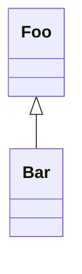

# example-host-application

> Executable example host application for the deno-dynamic-plugin-framework.

## Project Template Usage

1. Use as a
   [template](https://docs.github.com/en/github/creating-cloning-and-archiving-repositories/creating-a-repository-from-a-template)
   to create a new repository.
2. Update links and references in `README.md`.

## Binary Executable Usage

Download and extract zip from: https://github.com/flowscripter/template-deno-executable/releases

Run the executable: `./template-deno-executable`

## Development

Run: `deno run --unstable --allow-env --allow-read --allow-write --allow-ffi --allow-net mod.ts`

Test: `deno test -A --unstable`

Lint: `deno fmt mod.ts deps.ts src/ tests/`

Compile: `deno compile --unstable --allow-env --allow-read --allow-write --allow-ffi --allow-net mod.ts`

## Functional Tests

Refer to [functional_tests/README.md](functional_tests/README.md)

## Documentation

### Overview

### API

Link to auto-generated API docs for the library:

[API Documentation](https://doc.deno.land/https/raw.githubusercontent.com/flowscripter/example-host-application/main/mod.ts)

## License

MIT © Flowscripter
